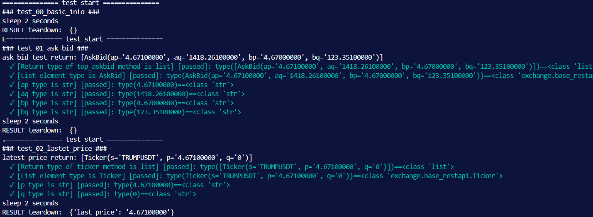

## KING-JUMP : Path to future crypto finance world

This project is a concise and efficient quantitative trading/market making/market value management system, written by PYTHON, lightweight and easy to expand. Programmers can easily deploy and run it, or extend their own functions.

If you need a more powerful and faster system, or customized development, please contact us.

### 1. OCTOPUS-PY CODE STRUTURE
```
.
├── docs
│   └── README.md
├── examples
├── octopuspy
│   ├── __init__.py
│   ├── exchange
│   │   ├── __init__.py
│   │   ├── base_restapi.py                # Base class for exchange REST API
│   │   ├── binance_future_restapi.py      # Binance Futures API
│   │   ├── binance_restapi.py             # Binance Spot API
│   │   ├── okx_future_restapi.py          # OKX Futures API
│   │   ├── okx_restapi.py                 # OKX Spot API
│   │   └── ...
│   └── utils                              # Utility classes
│       ├── __init__.py
│       ├── config_util.py
│       ├── db_util.py
│       ├── lark_bot.py
│       └── log_util.py
├── tests
│   ├── exchange_unittest.py                # Base class for spot exchange unit tests
│   ├── exchange_future_unittest.py         # Base class for futures exchange unit tests
│   ├── exchange_unittest_binance.py        # Binance spot exchange unit tests
│   ├── exchange_unittest_binance_future.py # Binance futures exchange unit tests
│   ├── exchange_unittest_okx.py            # OKX spot exchange unit tests
│   ├── exchange_unittest_okx_future.py     # OKX futures exchange unit tests
│   └── ...
├── .gitignore
├── LICENSE
├── README.md
└── requirements.txt
```
### 2. Deployment and dependencies
Pre-requirement: python (>=3.9)

#### 2.1 Linux:
2.1.1. Clone project from github
```
mkdir ~/king-jump
cd ~/king-jump
git clone https://github.com/King-Jump/octopus-py.git
```

2.1.2. Create virtual environment
```
cd ~/king-jump
python3 venv -m venv
```

2.1.3. Install dependencies
```
source venv/bin/activate
pip install -r ./octopuspy/requirements
```
2.1.4. Create file named 'test_env.py' in octopuspy, edit 'BASE_URL', 'API_KEY', 'SECRET', 'PASSPHRASE'.
```
cd octopus-py
```
test_env.py:
```
BASE_URL = 'https://api.binance.com'
API_KEY = "Your api_key"
SECRET = "Your api_secret"
PASSPHRASE = "" # Do not required by Binance, but required by OKX
```
Save test_env.py and run:
```
Python3 tests/exchange_unittest_binance.py
```
All standard market making APIs will be excuted, output like this:


#### 2.2 Other OS:
Similar to linux.

### 3. OCTOPUSPY
Octopus-py is a Python package for developing unified market making restful client to different crypto exchanges, easy to use and expand.

1. Understand unified market making APIs : [**here**](./docs/MARKET_MAKING.md)  
2. Develop your exchange client : [**here**](./docs/EXCHANGE_CLIENT.md)  

### 4. TEST 
1. Exchange client unit_test : [**here**](./doc/UNIT_TEST.md)
