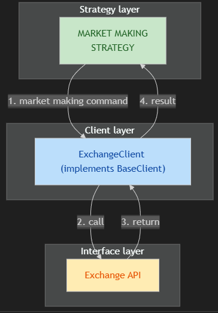

## STANDARD MARKET MAKING INTERFACE
Base class for exchange client : [**BaseClient**](../octopuspy/exchange/base_restapi.py)

### GET MARKET INFO
1. ASK1 AND BID1 PRICE
```python
    def top_askbid(self, symbol: str) -> list[AskBid]:
```
2. TICKERS
```python
    def ticker(self, symbol: str) -> list[Ticker]:
```

### TRADE
1. MAKE MULTIPLE ORDERS
```python
    def batch_make_orders(self, orders: list[NewOrder], symbol: str = '') -> list[OrderID]:
```
2. CANCEL MULTIPLE ORDERS
```python
    def batch_cancel(self, order_ids: list[str], symbol: str) -> list[OrderID]:
```
3. CANCEL ONE ORDER
```python
    def cancel_order(self, order_id: str, symbol: str = '') -> OrderID:
```

### STATUS
1. GET OPEN ORDERS
```python
    def open_orders(self, symbol: str) -> list[OrderStatus]:
```
2. GET ORDER STATUS
```python
    def order_status(self, order_id: str, symbol: str = '') -> list[OrderStatus]:
```

## DATA FLOW TO EXHANGES
