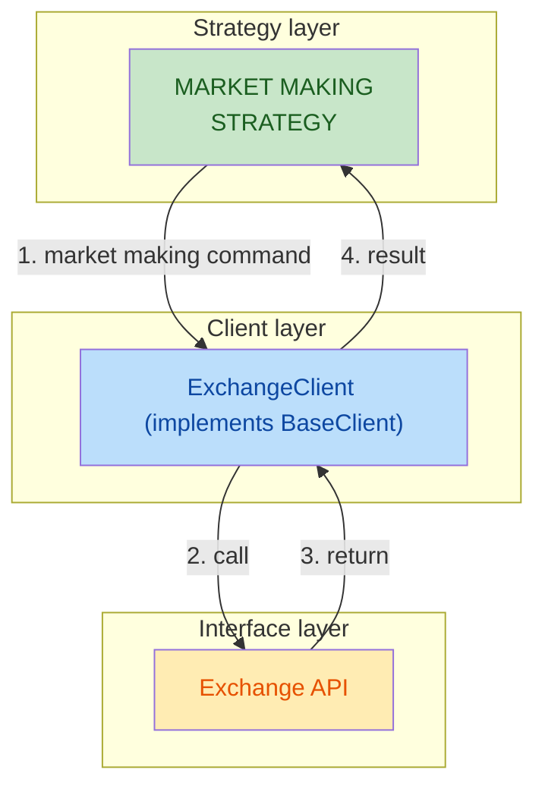

```mermaid
graph TD
    %% Modules
    subgraph "Strategy layer"
        A[MARKET MAKING<br/>STRATEGY]
    end
    
    subgraph "Client layer"
        B["ExchangeClient (implements BaseClient)"]
    end
    
    subgraph "Interface layer"
        D[Exchange API]
    end
    
    %% Connections
    A -- "1. market making command" --> B
    B -- "4. result" --> A
    B -- "2. call" --> D
    D -- "3. return" --> B
    
    %% Styles
    style A fill:#c8e6c9,color:#1b5e20
    style B fill:#bbdefb,color:#0d47a1
    style D fill:#ffecb3,color:#e65100
```